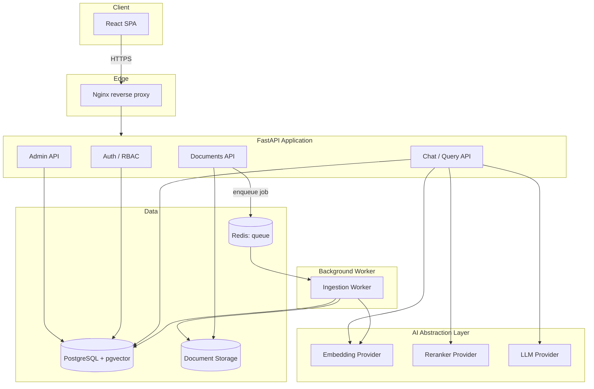

# Atlas

**Production-oriented RAG platform** — retrieval quality, evaluation, observability and secure document access. Not a toy chatbot demo: admins upload documents, they're chunked/embedded/indexed into pgvector, users ask questions, and the system retrieves + optionally reranks + generates a cited, grounded answer — or refuses when the answer genuinely isn't in the documents.


> **Status: all 8 planned phases complete** (scaffolding → MVP → retrieval quality → auth → versioning → evaluation → observability → hardening & delivery). Every claim below is backed by a real test, a real measured number, or a real live verification — not a projection. See [docs/ARCHITECTURE.md](docs/ARCHITECTURE.md) for the full design and [docs/EVALUATION.md](docs/EVALUATION.md) for measured results across five experiments.

## Contents

- [What's implemented](#whats-implemented)
- [Architecture](#architecture)
- [Evaluation highlights](#evaluation-highlights)
- [Quickstart](#quickstart)
- [Tech stack](#tech-stack)
- [Repository structure](#repository-structure)
- [Running tests](#running-tests)
- [Documentation](#documentation)
- [Known limitations](#known-limitations)

## What's implemented

- **RAG pipeline** — PDF/TXT/DOCX ingestion (async, off a Redis/Arq queue) → chunking → embedding → pgvector indexing → vector search, optionally fused with Postgres full-text search (Reciprocal Rank Fusion) and reranked with a local cross-encoder — both config-gated and off by default, backed by real evaluation numbers rather than a guess.
- **Auth & access control** — JWT auth, two roles (`admin`/`user`), document-level permissions enforced *in the SQL query itself*, not filtered after the fact.
- **Document versioning** — re-uploading a document creates a new version without breaking existing citations against old ones; a failed re-upload doesn't take down a document that was already working.
- **Evaluation framework** — a versioned 30-question golden dataset, five real experiments (embedding model comparison, chunking strategy comparison, hybrid search, reranking, and full end-to-end generation quality against a real LLM) — see [Evaluation highlights](#evaluation-highlights) below.
- **Observability** — structured JSON logging with request-ID correlation, real per-stage latency tracked per request, and an admin dashboard showing real p50/p95 sourced from that data.
- **Security hardening** — prompt-injection resistance tested against a real LLM (not just asserted), a secret-management audit, `.dockerignore`s, and an active warning if an insecure default secret ships outside development.
- **Delivery** — Nginx as a single entrypoint, migrations that actually run automatically on `docker compose up` (verified against a fully fresh, empty database), and a CI job that builds and smoke-tests the *real* Docker Compose stack end to end, not just isolated unit tests.

LLM and embedding calls go through [OpenRouter](https://openrouter.ai) by default (OpenAI-API-compatible, with a free-tier chat model) rather than OpenAI directly — see `backend/app/core/config.py` for the provider settings and how to point it back at real OpenAI.

## Architecture



AI providers (embeddings, reranker, LLM) are only ever reached through the abstraction layer, never called directly from routes — that's what makes the provider-comparison experiments in [docs/EVALUATION.md](docs/EVALUATION.md) possible without rewriting the pipeline. Full component breakdown and ERD in [docs/ARCHITECTURE.md](docs/ARCHITECTURE.md).

## Evaluation highlights

Real numbers from real runs against the golden dataset — full write-up with methodology and named limitations in [docs/EVALUATION.md](docs/EVALUATION.md).

| Experiment | Result |
|---|---|
| Structure-aware vs fixed-size chunking | **+54% Precision@5**, perfect MRR (1.000) |
| Hybrid search (vector + full-text) vs vector-only | No quality gain on this corpus — confirms the config-gated default of **off** |
| Cross-encoder reranking | MRR 0.979 → 1.000, at a **~30x p50 latency cost** — confirms the default of **off** |
| End-to-end generation quality (real LLM) | **1.000 correct-refusal rate, 0.000 hallucination rate** on unanswerable questions |
| Answer / citation correctness (real LLM) | 0.750 / 0.917 |

## Quickstart

```bash
cp .env.example .env
# edit .env and set OPENAI_API_KEY and OPENROUTER_API_KEY

cd infra
docker compose up --build
```

| Entrypoint | URL |
|---|---|
| **Single entrypoint (Nginx)** | http://localhost |
| Backend directly | http://localhost:8000 (docs at `/docs`, health at `/health`) |
| Frontend directly | http://localhost:5173 |

Migrations run automatically (a one-shot `migrate` service) — no manual `alembic upgrade head` needed even on a completely fresh database. The first account you register becomes admin.

## Tech stack

| Layer | Choice |
|---|---|
| Backend | Python 3.12, FastAPI, SQLAlchemy 2.0 (async), Alembic |
| Database | PostgreSQL 16 + pgvector (vectors and relational data in one store) |
| Background jobs | Redis + Arq |
| Frontend | React + TypeScript, Vite |
| LLM / embeddings | OpenRouter by default (OpenAI-compatible), swappable back to real OpenAI |
| Reranking | Local cross-encoder (`BAAI/bge-reranker-base`), CPU, lazily loaded |
| Reverse proxy | Nginx |
| Infra | Docker Compose, GitHub Actions CI |

No LangChain/LlamaIndex — the retrieval/chunking/prompt logic is owned and visible on purpose, since demonstrating and measuring that logic is the actual point of the project (see ARCHITECTURE.md §10 for the full reasoning).

## Repository structure

```
backend/    FastAPI application (app/api, app/services, app/ai, app/models, tests/)
frontend/   React + TypeScript SPA
infra/      Docker Compose, Nginx config, Postgres init scripts
eval/       Golden dataset, metrics, three experiment runners, JSON reports
docs/       Architecture and evaluation documentation
```

## Running tests

```bash
# Backend (from backend/, needs a running Postgres — see docs)
.venv/Scripts/python -m pytest -q

# Frontend
cd frontend && npm run lint && npm run build

# Evaluation framework (pure-logic tests, no DB)
backend/.venv/Scripts/python -m pytest eval/tests -q
```

The evaluation experiment runners live in `eval/runners/` — see [docs/EVALUATION.md](docs/EVALUATION.md) for what each one does and how to run it.

## Documentation

- [**docs/ARCHITECTURE.md**](docs/ARCHITECTURE.md) — full design: component breakdown, ERD, API structure, RAG/ingestion pipeline design, phased roadmap, and the reasoning behind every major tech choice, including explicitly rejected alternatives.
- [**docs/EVALUATION.md**](docs/EVALUATION.md) — real experiment results: embedding models, chunking strategies, hybrid search, reranking, and generation quality, each with numbers, analysis, and named limitations.

## Known limitations

Named honestly rather than glossed over — see the linked sections for full detail:

- The project's OpenAI account has no billing credits; embeddings/LLM calls go through OpenRouter instead (small real cost for embeddings, free for the LLM) — see `backend/app/core/config.py`.
- No OCR — content that only exists as an image (a scanned PDF page, a screenshot embedded in a `.docx`) is invisible to the pipeline — see `backend/app/ai/pipeline/extraction.py`.
- The 30-question golden evaluation dataset is smaller than ideal for statistical confidence — see [docs/EVALUATION.md](docs/EVALUATION.md#limitations).
