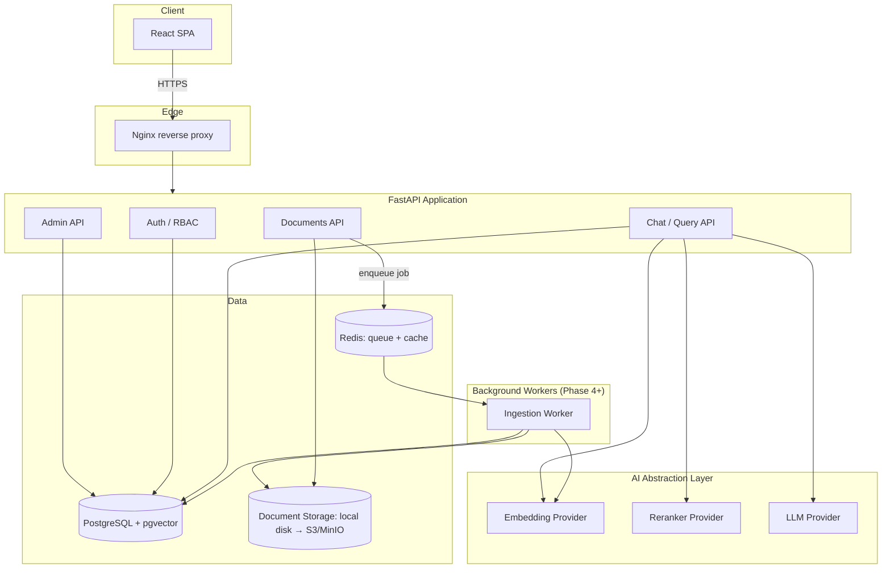
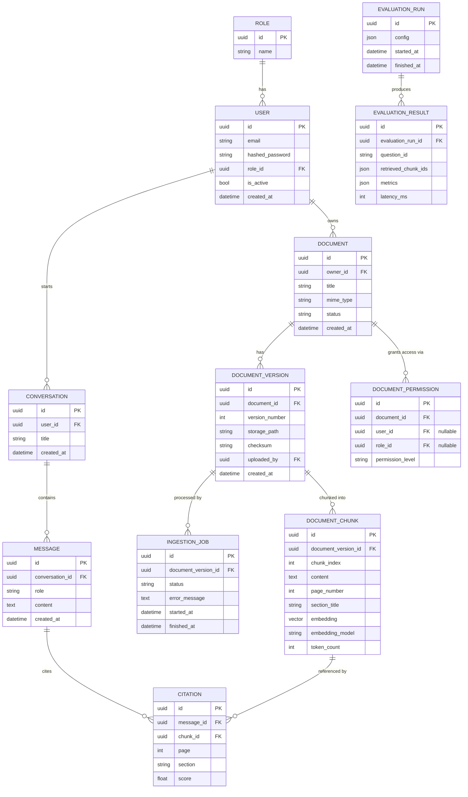
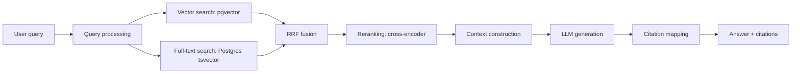

# ATLAS — Architecture Design

> Production-oriented RAG platform focused on retrieval quality, evaluation, observability and secure document access.

Status: **design phase, no implementation yet**. This document is the reference for all future implementation stages and will be updated as decisions evolve.

---

## 1. High-Level Architecture

Atlas has two independent pipelines sharing the same storage layer: **document ingestion** (write path) and **RAG query** (read path). Everything sits behind a single FastAPI service in the MVP; background processing is split out once ingestion needs to be async (Phase 4).



**Why this shape:**
- One deployable API service for MVP — no premature microservices. Splitting ingestion into a worker only happens once ingestion is genuinely async (Phase 4), which is also when Redis earns its place in the stack.
- The AI layer is accessed only through abstractions (`EmbeddingProvider`, `RerankerProvider`, `LLMProvider`), never directly by API routes — this is what makes the "compare 2 embedding models" and "vector vs hybrid vs rerank" experiments possible without rewriting the pipeline.
- Postgres is the single source of truth for both relational data and vectors (pgvector), avoiding a second database system until there's evidence it's needed (see Risks, §10).

---

## 2. Component Responsibilities

| Component | Responsibility | Does NOT do |
|---|---|---|
| **API layer** (`api/v1/*`) | HTTP contracts, request validation, auth checks, orchestration calls into services | Business logic, DB queries, prompt construction |
| **Services** (`services/*`) | Use-case logic: `ingestion_service`, `retrieval_service`, `chat_service`, `evaluation_service` | HTTP concerns, raw SQL |
| **Repositories** (`repositories/*`) | SQLAlchemy queries, permission-filtered data access | Business rules |
| **AI providers** (`ai/embeddings`, `ai/reranker`, `ai/llm`) | Thin adapters over external APIs/local models behind a common interface | Pipeline orchestration |
| **Pipelines** (`ai/pipeline/*`) | `ingestion_pipeline.py`, `rag_pipeline.py` — stage orchestration, no HTTP/DB coupling | Talking to FastAPI directly |
| **Workers** (`workers/*`) | Execute ingestion jobs pulled from Redis queue | Serving HTTP requests |
| **Frontend** (`frontend/*`) | Chat UI, document management, admin dashboard | Business validation (still validated server-side) |

This is a fairly standard layered architecture (API → services → repositories), chosen over Clean Architecture/hexagonal ports-and-adapters because the extra ceremony isn't justified at this scope — the one place we *do* pay for an interface (AI providers) is the one place we actually swap implementations.

---

## 3. Repository Structure

Monorepo — a single reviewer (internship evaluator, GitHub visitor) should be able to open one repo and see the whole system.

```
atlas/
├── backend/
│   ├── app/
│   │   ├── api/v1/                 # auth.py, documents.py, chat.py, admin.py, router.py
│   │   ├── core/                   # config.py, security.py, logging.py, exceptions.py
│   │   ├── db/                     # session.py, base.py
│   │   ├── models/                 # SQLAlchemy ORM models
│   │   ├── schemas/                # Pydantic request/response models
│   │   ├── repositories/           # data access, permission-aware queries
│   │   ├── services/               # ingestion_service, retrieval_service, chat_service, evaluation_service
│   │   ├── ai/
│   │   │   ├── embeddings/         # base.py + openai.py, sentence_transformers.py
│   │   │   ├── reranker/           # base.py + cross_encoder.py, cohere.py
│   │   │   ├── llm/                # base.py + openai.py
│   │   │   └── pipeline/           # ingestion_pipeline.py, rag_pipeline.py
│   │   ├── workers/                # arq worker entrypoint + tasks (Phase 4+)
│   │   └── main.py
│   ├── alembic/
│   ├── tests/
│   │   ├── unit/
│   │   ├── integration/            # testcontainers: real Postgres+pgvector
│   │   └── e2e/
│   ├── pyproject.toml
│   └── Dockerfile
├── frontend/
│   ├── src/
│   │   ├── pages/                  # Login, Chat, Documents, DocumentViewer, AdminDashboard
│   │   ├── components/
│   │   ├── api/                    # typed client
│   │   └── hooks/
│   ├── e2e/                        # Playwright
│   ├── package.json
│   └── Dockerfile
├── eval/
│   ├── dataset/golden_qa.yaml      # versioned, human-reviewable golden set
│   ├── runners/run_evaluation.py
│   ├── metrics/                    # recall_at_k.py, mrr.py, groundedness.py, ...
│   └── reports/                    # generated benchmark reports (markdown/json)
├── infra/
│   ├── docker-compose.yml          # MVP: backend, frontend, postgres
│   ├── docker-compose.full.yml     # adds redis, worker, nginx (later phases)
│   ├── nginx/
│   └── postgres/init/              # CREATE EXTENSION vector, etc.
├── docs/
│   ├── ARCHITECTURE.md             # this file
│   ├── ERD.md
│   ├── API.md
│   └── EVALUATION.md
├── .github/workflows/ci.yml
├── .env.example
└── README.md
```

`eval/` is top-level, not buried in `backend/tests` — it's a first-class deliverable of this project, not test scaffolding.

---

## 4. Database Schema (ERD)



**Notable decisions:**

- `embedding_model` lives **on the chunk row**, not just in config. Swapping embedding models doesn't mutate old rows in place — it produces a new set of chunks tagged with the new model, so multiple embedding models can coexist for the A/B experiment in §"Quality/Evaluation" without re-ingesting documents twice from scratch on every comparison run.
- `DOCUMENT_PERMISSION` supports both user-level and role-level grants (one of the two FKs is set). Retrieval queries join through this table — access control is enforced **in the SQL query that produces candidate chunks**, not as a post-filter on results (see Risk §10.4).
- The golden evaluation **dataset** (questions, expected answers, expected sources) is *not* a DB table — it lives as versioned YAML in `eval/dataset/`, reviewable in PRs like code. Only **run results** (`EVALUATION_RUN`/`EVALUATION_RESULT`) go to Postgres, because the admin dashboard needs to query them.

---

## 5. API Structure

Versioned under `/api/v1`. OpenAPI docs auto-generated by FastAPI at `/docs`.

```
POST   /api/v1/auth/register
POST   /api/v1/auth/login
POST   /api/v1/auth/refresh

GET    /api/v1/documents
POST   /api/v1/documents                    # multipart upload
GET    /api/v1/documents/{id}
PUT    /api/v1/documents/{id}                # metadata update / new version
DELETE /api/v1/documents/{id}
GET    /api/v1/documents/{id}/status         # ingestion status (poll or SSE later)
GET    /api/v1/documents/{id}/chunks/{chunk_id}   # inspect source fragment (citation drill-down)

POST   /api/v1/chat/query
GET    /api/v1/chat/conversations
GET    /api/v1/chat/conversations/{id}

GET    /api/v1/admin/metrics
GET    /api/v1/admin/evaluations
POST   /api/v1/admin/evaluations/run

GET    /health
GET    /health/ready                          # DB + vector index reachable
```

Changes from the suggested list: `chat/history` → `chat/conversations[/{id}]` (matches the `Conversation`/`Message` model instead of a flat history blob), added a chunk-inspection endpoint (required by "frontend should allow the user to inspect the source fragment behind a citation"), and split `/health` from `/health/ready` (standard liveness/readiness split, useful once this runs in Docker/CI with healthchecks).

---

## 6. RAG Pipeline Design



| Stage | MVP (Phase 1) | Later (Phase 2+) |
|---|---|---|
| Query processing | Pass-through + basic normalization | Query rewriting/expansion (only if eval shows it's needed) |
| Retrieval | pgvector cosine top-K only | + Postgres full-text search, fused with **Reciprocal Rank Fusion** |
| Reranking | none | Local cross-encoder (`bge-reranker-base`), top-K → top-N |
| Context construction | Concatenate top-K chunks with metadata, token-budget truncation | Dedup near-identical chunks, section grouping |
| Generation | Single LLM call, strict "answer only from context" system prompt | — |
| Citations | Map used chunks → document/version/page/section | Confidence/groundedness score per citation |
| Refusal | Prompt instructs "say you don't know if the context doesn't answer the question" | Measured explicitly via evaluation (correct-refusal rate) |

**Prompt-injection stance (applies from MVP, not deferred):** retrieved chunks are always injected as clearly delimited, labeled data (e.g. wrapped in `<context>` blocks) in the user-turn content, never concatenated into the system prompt. The system prompt explicitly instructs the model to treat `<context>` content as untrusted reference material and to ignore any instructions found inside it. This is cheap to do from day one and expensive to retrofit, so it's not on the "later" list.

---

## 7. Document Ingestion Pipeline

```
Upload → validation → storage → text extraction → cleaning →
structure detection → chunking → metadata extraction →
embedding generation → vector indexing → READY
```

| Stage | MVP approach |
|---|---|
| Validation | MIME type + extension allowlist (pdf/txt/docx), max file size |
| Storage | Local filesystem behind a `StorageBackend` interface (swap to S3/MinIO later without touching callers) |
| Text extraction | `pypdf`/`pdfplumber` (PDF), `python-docx` (DOCX), direct read (TXT) |
| Cleaning | Whitespace normalization, repeated header/footer stripping, encoding fixes |
| Structure detection | Heuristic: DOCX styles / PDF font-size jumps → heading candidates; fallback to paragraph splitting |
| Chunking | Recursive splitter with overlap (baseline); structure-aware chunking added as the second strategy for the required chunking experiment |
| Metadata | page number, section title, chunk index, token count |
| Embedding | Batched calls through the embedding provider abstraction |
| Indexing | Insert into `document_chunk`, HNSW index on `embedding` |
| Status | `IngestionJob`: `PENDING → PROCESSING → READY | FAILED`, polled via `/documents/{id}/status` |

MVP runs this synchronously inside the upload request (acceptable for portfolio-scale files); it moves to the Arq worker + Redis queue in Phase 4 once processing time/volume actually justifies async execution — no queue infrastructure sits idle waiting to be used.

---

## 8. MVP Scope (Phase 1)

Deliberately narrower than the full feature list — no auth, no Redis, no Nginx, one embedding model, one LLM, no reranking, no hybrid search:

- FastAPI + PostgreSQL + pgvector (Docker Compose, 3 services: backend, frontend, postgres)
- Upload PDF/TXT/DOCX → synchronous ingestion → chunk → embed → index
- Plain vector search (top-K, no hybrid, no rerank)
- LLM answer generation with strict grounding + citations (document/page/section)
- React chat page: ask, see answer, see citations, click a citation to view the source fragment
- No login — single implicit user, since auth is explicitly a Phase 3 addition

This is intentionally the smallest slice that exercises **both full pipelines end-to-end** (ingestion write path, RAG read path) — everything after this is depth (quality, security, ops), not new pipeline shape.

---

## 9. Development Milestones

| Phase | Adds | Exit criterion |
|---|---|---|
| 0 — Scaffolding | Repo structure, docker-compose skeleton, CI lint+test skeleton, health endpoints | `docker compose up` boots empty app |
| 1 — MVP | See §8 | Upload a PDF, ask a question, get a cited answer, in the browser |
| 2 — Retrieval quality | Hybrid search (FTS + RRF), reranking (cross-encoder) | Both toggleable via config, both benchmarked against MVP baseline |
| 3 — Auth & access control | Login, RBAC, document-level permissions, rate limiting | Unauthorized user provably cannot retrieve a restricted chunk (test-covered) |
| 4 — Versioning & async ingestion | `DocumentVersion`, Redis + Arq worker, job status polling | Re-uploading a document creates a new version without breaking old citations |
| 5 — Evaluation framework | Golden dataset, all required metrics, experiment runner, benchmark report | `docs/EVALUATION.md` answers every question in the brief with numbers |
| 6 — Observability | structlog, request-ID middleware, per-stage latency tracking, admin dashboard | p50/p95 visible in the UI, sourced from real logged data |
| 7 — Hardening & delivery | Prompt-injection tests, secret management, Nginx, CI/CD (build+test+deploy), README polish | Fresh clone → `docker compose up` → working demo, green CI badge |

Each phase follows the 8-step process from your brief (explain → why → architecture impact → implement → test → verify → risks → next). We'll do that per-phase, not per-file.

---

## 10. Technology Choices & Alternatives

| Concern | Recommendation | Alternatives considered | Why |
|---|---|---|---|
| Embeddings | OpenAI `text-embedding-3-small` + `BAAI/bge-small-en` (local, via `sentence-transformers`) | Cohere Embed v3, Voyage AI | Need **two** models for the required comparison; pairing one API model with one free local model keeps repeated eval runs cheap and keeps the abstraction honest (proves it isn't OpenAI-only) |
| LLM | OpenAI `gpt-4o-mini`, behind `LLMProvider` interface | GPT-4o, other hosted chat models | Cheap/fast for the dev loop and for running evaluation many times; swap to a stronger model only for the final benchmark comparison |
| Reranker | Local cross-encoder `bge-reranker-base` (CPU, `sentence-transformers`) | Cohere Rerank API | No per-call cost during heavy eval iteration, no external dependency; matters more here than for LLM/embeddings because reranking runs on every query in the benchmarked variants |
| Vector store | pgvector inside the existing Postgres | Qdrant, Weaviate, Pinecone | One database instead of two; pgvector's HNSW index is sufficient at portfolio scale (thousands–low tens of thousands of chunks) — see Risk 10.1 for the ceiling |
| Hybrid search | Postgres full-text search (`tsvector`) + Reciprocal Rank Fusion | Elasticsearch/OpenSearch | Zero new infrastructure; RRF is simple, well-understood, and easy to explain in the README |
| Background jobs | Arq (async, Redis-backed) | Celery, RQ | Async-native — fits the existing async FastAPI/SQLAlchemy stack directly, far less operational surface than Celery |
| Storage | Local filesystem behind a `StorageBackend` interface | S3/MinIO from day one | Simplicity now, cheap to swap later — the interface is the actual deliverable, not the backend |
| Eval metrics | Custom `Recall@K`/`Precision@K`/`MRR`/latency + `ragas` for faithfulness/groundedness | 100% custom metrics | Recall/Precision/MRR are simple enough to own; groundedness/faithfulness scoring is a solved, peer-reviewed problem — reimplementing it badly is worse than citing a real library |
| Logging | `structlog` | stdlib logging + JSON formatter | Contextual binding (request_id, user_id) without manual boilerplate on every log line |
| Frontend data layer | TanStack Query | Redux Toolkit | Chat/documents/admin are all server-state-shaped problems; Query's caching/polling fits `documents/{id}/status` directly, no Redux boilerplate needed |

**Explicitly rejected:** LangChain/LlamaIndex as pipeline orchestrators. Reason: they'd hide the exact mechanics (chunking, retrieval, prompt assembly) that this project exists to demonstrate and measure — a portfolio project about RAG *quality* is weaker if the retrieval logic is a black box import. Narrow, well-scoped libraries (`pypdf`, `tiktoken`, `tenacity`, `ragas`) are fine; a framework that owns the pipeline is not.

---

## 11. Architectural Risks

1. **pgvector scaling ceiling.** HNSW query/build cost grows with corpus size. Mitigation: keep the demo corpus at portfolio scale, document the migration path to a dedicated vector DB as a named "Future Improvement" rather than pretending it won't matter.
2. **Embedding model swaps require re-embedding.** Changing provider/model doesn't update old vectors in place. Mitigation: `embedding_model` tagged per chunk (§4) so multiple models can coexist during comparison experiments instead of destructively re-indexing.
3. **Prompt injection via document content.** A malicious/adversarial document could contain text like "ignore previous instructions." Mitigation: chunks are always passed as clearly delimited untrusted data, never merged into the system prompt (§6); this needs an explicit eval-set case (adversarial document) in Phase 5, not just a hopeful prompt.
4. **RBAC leakage through retrieval.** If permission filtering happens *after* vector search (post-filter), the top-K can be starved by inaccessible documents, degrading answers for legitimate users — or worse, leak content if filtering is skipped. Mitigation: access control is a join condition in the retrieval SQL, not an app-layer filter (§4); needs a dedicated test: "user cannot retrieve a chunk from a document they don't have permission for."
5. **Latency budget creep.** Hybrid search + reranking + LLM call is a longer chain than plain vector search. Mitigation: instrument per-stage latency starting in the MVP (even with only one stage to measure) so Phase 2 additions are judged against a real baseline instead of intuition.
6. **Evaluation dataset size/bias.** A small hand-built golden set risks the benchmark conclusions ("hybrid search helps") not generalizing. Mitigation: target ≥50–100 QA pairs covering answerable + unanswerable cases, and state the sample size as a named limitation in the README regardless.
7. **Evaluation cost blowup.** The required experiment matrix (2 embedding models × hybrid on/off × rerank on/off × 2 chunking strategies) multiplies quickly across N questions and LLM calls. Mitigation: cache embeddings and LLM responses per eval run, default to the cheap LLM for the full matrix, reserve the expensive model for a final confirmation pass.
8. **Docker Compose complexity creep.** Services get added phase by phase (Redis, worker, Nginx). Mitigation: keep a minimal `docker-compose.yml` for early phases and a `docker-compose.full.yml` overlay once Phase 4+ services exist, so the MVP stays a 3-service, one-command demo.
